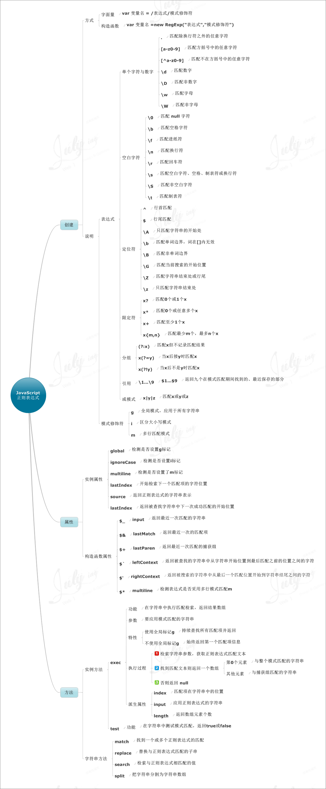

## 思维导图

<!-- MarkdownTOC -->

- [变量](#变量)
- [流程语句](#流程语句)
- [运算符](#运算符)
- [数组](#数组)
- [函数基础](#函数基础)
- [字符串函数](#字符串函数)
- [基本dom操作](#基本dom操作)
- [正则表达式](#正则表达式)

<!-- /MarkdownTOC -->

## 变量

## 流程语句

## 运算符

## 数组

## 函数基础

## 字符串函数

## 基本dom操作

## 正则表达式

